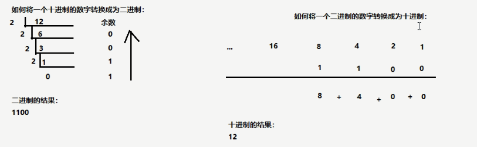
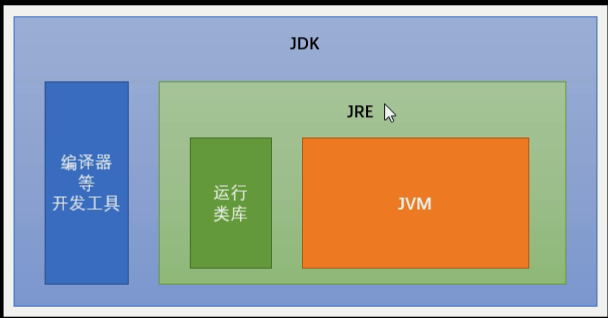

# 01 前言、入门程序、常量、变量

**关键词**
前言、入门程序、常量、变量

---

# 笔记


### 二进制转换
- 十进制转二进制用短除法
- 二进制转十进制用8421法
 

 **不考试用计算器算**
 ### 常用Dos命令
- 命令提示符`cmd`
- 启动`win+r`
- 切换盘符
  - 进入文件夹`cd 文件夹名称`
  - 进入多级文件夹`cd 文件夹1\文件夹2\文件夹3`
  - 返回上一级`cd ..`
  - 返回根目录`cd \`
- 查看单签内容`dir`
- 清屏 `cls`
- 退出 `exit`

### java运行环境
Jdk包含JRE包含JVM


### 第一个Java程序
```java
public class HelloWord{
    public static void main(String[] args){
        System.out.println("HelloWorld!");
    }
}

```
### 关键字(keywords)
指Java程序中,Java已经定义好有特殊意义的字符
1. 完全小写的
2. 在特殊文本编辑器里面有特殊颜色的     
### 标识符
**标识符** 是指在程序中,我们定义的内容,比如类的名字,方法和变量的名字等,都是标识符
- 命名规则(强制)
  - 标识符可以包括26个英文字母,数字`$`符号和下划线`_`
  - 标识符不可以苏子开头
  - 标识符不可以是关键字
- 命名规范(建议)
  - 类名(大驼峰)
  - 方法名和变量名(小驼峰)

### 常量

**常量：** 在程序运行期间，固定不变的量。

**常量的分类：**
1. 字符串常量：凡是用双引号引起来的部分，叫做字符串常量。例如："abc"、"Hello"、"123"
2. 整数常量：直接写上的数字，没有小数点。例如：100、200、0、-250
3. 浮点数常量：直接写上的数字，有小数点。例如：2.5、-3.14、0.0
4. 字符常量：凡是用单引号引起来的单个字符，就做字符常量。例如：'A'、'b'、'9'、'中'
5. 布尔常量：只有量中取值。true、false。
6. 空常量：null。代表没有任何数据。
```java
public class Demo01Const {
	public static void main(String[] args) {
		// 字符串常量
		System.out.println("ABC");
		System.out.println(""); // 字符串两个双引号中间的内容为空
		System.out.println("XYZ");
		
		// 整数常量
		System.out.println(30);
		System.out.println(-500);
		
		// 浮点数常量（小数）
		System.out.println(3.14);
		System.out.println(-2.5);
		
		// 字符常量
		System.out.println('A');
		System.out.println('6');
		// System.out.println(''); // 两个单引号中间必须有且仅有一个字符，没有不行。
		// System.out.println('AB'); // 两个单引号中间必须有且仅有一个字符，有两个不行。
		
		// 布尔常量
		System.out.println(true);
		System.out.println(false);
		
		// 空常量。空常量不能直接用来打印输出。
		// System.out.println(null);
	}
}

```
### 数据类型
**基本数据类型**

- **整数型** `byte` `short` `int` `long`

- **浮点型** `float` `double`

- **字符型** `char`

- **布尔型** `boolean`

注意事项：
1. 字符串不是基本类型，而是引用类型。
2. 浮点型可能只是一个近似值，并非精确的值。
3. 数据范围与字节数不一定相关，例如float数据范围比1ong更加广泛，但是float是4字节，long是8字节。
4. 浮点数当中默认类型是double。如果一定要使用float类型，需要加上一个后缀F。
如果是整数，默认为int类型，如果一定要使用long类型，需要加上一个后缀L。推荐使用大写字母后缀。|
### 变量
- 变量：程序运行期间，内容可以发生改变的量。

- 创建一个变量并且使用的格式：

- `数据类型 变量名称;` // 创建了一个变量

- `变量名称 = 数据值;` // 赋值，将右边的数据值，赋值交给左边的变量

一步到位的格式：

`数据类型 变量名称 = 数据值;` // 在创建一个变量的同时，立刻放入指定的数据值
```java
public class Demo02Variable {
	public static void main(String[] args) {
		// 创建一个变量
		// 格式：数据类型 变量名称;
		int num1;
		// 向变量当中存入一个数据
		// 格式：变量名称 = 数据值;
		num1 = 10;
		// 当打印输出变量名称的时候，显示出来的是变量的内容
		System.out.println(num1); // 10
		
		// 改变变量当中本来的数字，变成新的数字
		num1 = 20;
		System.out.println(num1); // 20
		
		// 使用一步到位的格式来定义变量
		// 格式：数据类型 变量名称 = 数据值;
		int num2 = 25;
		System.out.println(num2); // 25
		
		num2 = 35;
		System.out.println(num2); // 35
		System.out.println("===============");
		
		byte num3 = 30; // 注意：右侧数值的范围不能超过左侧数据类型的取值范围
		System.out.println(num3); // 30
		
		// byte num4 = 400; // 右侧超出了byte数据范围，错误！
		
		short num5 = 50;
		System.out.println(num5); // 50
		
		long num6 = 3000000000L;
		System.out.println(num6); // 3000000000
		
		float num7 = 2.5F;
		System.out.println(num7); // 2.5
		
		double num8 = 1.2;
		System.out.println(num8); // 1.2
		
		char zifu1 = 'A';
		System.out.println(zifu1); // A
		
		zifu1 = '中';
		System.out.println(zifu1); // 中
		
		boolean var1 = true;
		System.out.println(var1); // true
		
		var1 = false;
		System.out.println(var1); // false
		
		// 将一个变量的数据内容，赋值交给另一个变量
		// 右侧的变量名称var1已经存在，里面装的是false布尔值
		// 将右侧变量里面的false值，向左交给var2变量进行存储
		boolean var2 = var1;
		System.out.println(var2); // false
	}
}
```

#### 变量的注意事项
使用变量的时候，有一些注意事项：

1. 如果创建多个变量，那么变量之间的名称不可以重复。
2. 对于float和long类型来说，字母后缀F和L不要丢掉。
3. 如果使用byte或者short类型的变量，那么右侧的数据值不能超过左侧类型的范围。
4. 没有进行赋值的变量，不能直接使用；一定要赋值之后，才能使用。
5. 变量使用不能超过作用域的范围。
【作用域】：从定义变量的一行开始，一直到直接所属的大括号结束为止。
6. 可以通过一个语句来创建多个变量，但是一般情况不推荐这么写。
```java
public class Demo03VariableNotice {
	public static void main(String[] args) {
		int num1 = 10; // 创建了一个新的变量，名叫num1
		// int num1 = 20; // 又创建了另一个新的变量，名字也叫num1，错误！
		
		int num2 = 20;
		
		int num3;
		num3 = 30;
		
		int num4; // 定义了一个变量，但是没有进行赋值
		// System.out.println(num4); // 直接使用打印输出就是错误的！
		
		// System.out.println(num5); // 在创建变量之前，不能使用这个变量
		
		int num5 = 500;
		System.out.println(num5); // 500
		
		{
			int num6 = 60;
			System.out.println(num6); // 60
		}
		// int num6;
		// System.out.println(num6); // 已经超出了大括号的范围，超出了作用域，变量不能再使用了
		
		// 同时创建了三个全都是int类型的变量
		int a, b, c;
		// 各自分别赋值
		a = 10;
		b = 20;
		c = 30;
		System.out.println(a); // 10
		System.out.println(b); // 20
		System.out.println(c); // 30
		
		// 同时创建三个int变量，并且同时各自赋值
		int x = 100, y = 200, z = 300;
		System.out.println(x); // 100
		System.out.println(y); // 200
		System.out.println(z); // 300
	}
}
```


---

# 总结