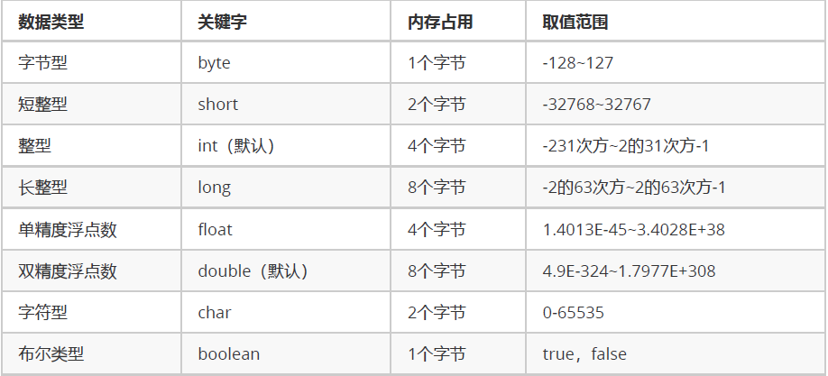

# 数据类型转换、运算符、方法入门

**关键词**

`数据类型转换`、`运算符`、`方法入门`

---

# 笔记

## 听课
## 数据类型的强制转换

1. 自动类型转换(隐式)
   1. 代码不需要处理自动完成
   2. 数据范围从小到大
```java
public class Demo01DataType {
	public static void main(String[] args) {
		System.out.println(1024); // 这就是一个整数，默认就是int类型
		System.out.println(3.14); // 这就是一个浮点数，默认就是double类型
		
		// 左边是long类型，右边是默认的int类型，左右不一样
		// 一个等号代表赋值，将右侧的int常量，交给左侧的long变量进行存储
		// int --> long，符合了数据范围从小到大的要求
		// 这一行代码发生了自动类型转换。
		long num1 = 100;
		System.out.println(num1); // 100
		
		// 左边是double类型，右边是float类型，左右不一样
		// float --> double，符合从小到大的规则
		// 也发生了自动类型转换
		double num2 = 2.5F;
		System.out.println(num2); // 2.5
		
		// 左边是float类型，右边是long类型，左右不一样
		// long --> float，范围是float更大一些，符合从小到大的规则
		// 也发生了自动类型转换
		float num3 = 30L;
		System.out.println(num3); // 30.0
	}
}
```

2. 强制类型转换(显式)
强制类型转换
   1. 特点：代码需要进行特殊的格式处理，不能自动完成。
   2. 格式：范围小的类型 范围小的变量名 = (范围小的类型) 原本范围大的数据;
```java
public class Demo02DataType {
	public static void main(String[] args) {
		// 左边是int类型，右边是long类型，不一样
		// long --> int，不是从小到大
		// 不能发生自动类型转换！
		// 格式：范围小的类型 范围小的变量名 = (范围小的类型) 原本范围大的数据;
		int num = (int) 100L;
		System.out.println(num);
		//long的数据类型转为int
		int num =6000000000L;
		System.out.println(num2);	//精度损失
		//double-->int 大转小(强转)
		int num3 = (int)3.99;//这不是四舍五入 3

		char zifu1 = 'A'; // 这是一个字符型变量，里面是大写字母A
		System.out.println(zifu1 + 1); // 66，也就		char zifu1 = 'A'; // 这是一个字符型变量，里面是大写字母A是大写字母A被当做65进行处理
		// 计算机的底层会用一个数字（二进制）来代表字符A，就是65
		// 一旦char类型进行了数学运算，那么字符就会按照一定的规则翻译成为一个数字
		byte num4 = 40; // 注意！右侧的数值大小不能超过左侧的类型范围
		byte num5 = 50;
		// byte + byte --> int + int --> int
		int result1 = num4 + num5;
		System.out.println(result1); // 90
		short num6 = 60;
		// byte + short --> int + int --> int
		// int强制转换为short：注意必须保证逻辑上真实大小本来就没有超过short范围，否则会发生数据溢出
		short result2 = (short) (num4 + num6);
		System.out.println(result2); // 100
		   
```
**注意事项**
1. 强制类型转换不推荐使用(会发生精度损失和内存溢出)
2. byte/short/char这三种类型可以发生数学运算,例如`+`
3. byte/short/char这三种数据类型运算的时候,必须把类型提升至int类型
4. boolean不能发生数据类型运算

### 数字和字符的关系对照表
ASCII码表：American Standard Code for Information Interchange，美国信息交换标准代码。
Unicode码表：万国码。也是数字和符号的对照关系，开头0-127部分和ASCII完全一样，但是从128开始包含有更多字符。
```java
48 - '0'
65 - 'A'
97 - 'a'
```
```java
public class Demo03DataTypeChar {
	public static void main(String[] args) {
		char zifu1 = '1';
		System.out.println(zifu1 + 0); // 49
		
		char zifu2 = 'A'; // 其实底层保存的是65数字
		
		char zifu3 = 'c';
		// 左侧是int类型，右边是char类型，
		// char --> int，确实是从小到大
		// 发生了自动类型转换
		int num = zifu3;
		System.out.println(num); // 99
		
		char zifu4 = '中'; // 正确写法
		System.out.println(zifu4 + 0); // 20013
	}
}
```

## 运算符

**运算符**：进行特定操作的符号。例如`+`

**表达式**：用运算符连起来的式子叫做表达式。例如：20 + 5。又例如：`a + b`

**四则运算**：
- 加：+
- 减：-
- 乘：*
- 除：/
  - 对于一个整数的表达式来说，除法用的是整除，整数除以整数，结果仍然是整数。只看商，不看余数。
- 取模（取余数）：%
	- 被除数 / 除数 = 商 ... 余数
  	- 只有对于整数的除法来说，取模运算符才有余数的意义

```java
public class Demo04Operator {
	public static void main(String[] args) {
		// 两个常量之间可以进行数学运算
		System.out.println(20 + 30);
		
		// 两个变量之间也可以进行数学运算
		int a = 20;
		int b = 30;
		System.out.println(a - b); // -10
		
		// 变量和常量之间可以混合使用
		System.out.println(a * 10); // 200
		
		int x = 10;
		int y = 3;
		
		int result1 = x / y;
		System.out.println(result1); // 3
		
		int result2 = x % y;
		System.out.println(result2); // 余数，模，1
		
		// int + double --> double + double --> double
		double result3 = x + 2.5;
		System.out.println(result3); // 12.5
	}
}
```
**注意事项**
1. 一旦运算当中有不同类型的数据，那么结果将会是数据类型范围大的那种。
### 四则运算 "+" 有三种常见的方法
1. 对于数值来说，那就是加法。
2. 对于字符char类型来说，在计算之前，char会被提升成为int，然后再计算。
char类型字符，和int类型数字，之间的对照关系表：ASCII、Unicode
3. 对于字符串String（首字母大写，并不是关键字）来说，加号代表字符串连接操作。
任何数据类型和字符串进行连接的时候，结果都会变成字符串
```java
public class Demo05Plus {
	public static void main(String[] args) {
		// 字符串类型的变量基本使用
		// 数据类型 变量名称 = 数据值;
		String str1 = "Hello";
		System.out.println(str1); // Hello
		
		System.out.println("Hello" + "World"); // HelloWorld
		
		String str2 = "Java";
		// String + int --> String
		System.out.println(str2 + 20); // Java20
		
		// 优先级问题
		// String + int + int
		// String		+ int
		// String
		System.out.println(str2 + 20 + 30); // Java2030
		
		System.out.println(str2 + (20 + 30)); // Java50
	}
}
```
### 自增和自减运算符

**自增运算符**：++

**自减运算符**：--

基本含义：让一个变量涨一个数字1，或者让一个变量降一个数字1

使用格式：写在变量名称之前，或者写在变量名称之后。例如：++num，也可以num++

**使用方式**：
1. 单独使用：不和其他任何操作混合，自己独立成为一个步骤。
2. 混合使用：和其他操作混合，例如与赋值混合，或者与打印操作混合，等。

**使用区别**

1. 在单独使用的时候，前++和后++没有任何区别。也就是：++num;和num++;是完全一样的。
2. 在混合的时候，有【重大区别】
	A. 如果是【前++】，那么变量【立刻马上+1】，然后拿着结果进行使用。	【先加后用】
	B. 如果是【后++】，那么首先使用变量本来的数值，【然后再让变量+1】。	【先用后加】
```java	
public class Demo06Operator {
	public static void main(String[] args) {
		int num1 = 10;
		System.out.println(num1); // 10
		++num1; // 单独使用，前++
		System.out.println(num1); // 11
		num1++; // 单独使用，后++
		System.out.println(num1); // 12
		System.out.println("=================");
		
		// 与打印操作混合的时候
		int num2 = 20;
		// 混合使用，先++，变量立刻马上变成21，然后打印结果21
		System.out.println(++num2); // 21
		System.out.println(num2); // 21
		System.out.println("=================");
		
		int num3 = 30;
		// 混合使用，后++，首先使用变量本来的30，然后再让变量+1得到31
		System.out.println(num3++); // 30
		System.out.println(num3); // 31
		System.out.println("=================");
		
		int num4 = 40;
		// 和赋值操作混合
		int result1 = --num4; // 混合使用，前--，变量立刻马上-1变成39，然后将结果39交给result1变量
		System.out.println(result1); // 39
		System.out.println(num4); // 39
		System.out.println("=================");
		
		int num5 = 50;
		// 混合使用，后--，首先把本来的数字50交给result2，然后我自己再-1变成49
		int result2 = num5--;
		System.out.println(result2); // 50
		System.out.println(num5); // 49
		System.out.println("=================");
		
		int x = 10;
		int y = 20;
		// 11 + 20 = 31
		int result3 = ++x + y--;
		System.out.println(result3); // 31
		System.out.println(x); // 11
		System.out.println(y); // 19
		
		// 30++; // 错误写法！常量不可以使用++或者--
	}
}
```
**注意事项**：
	只有变量才能使用自增、自减运算符。常量不可发生改变，所以不能用。
### 赋值运算符分为
**基本赋值运算符**：就是一个等号“=”，代表将右侧的数据交给左侧的变量。
	int a = 30;

**复合赋值运算符**：
	+=		a += 3		相当于		a = a + 3
	-=		b -= 4		相当于		b = b - 4
	*=		c *= 5		相当于		c = c * 5
	/=		d /= 6		相当于		d = d / 6
	%=		e %= 7		相当于		e = e % 7

**注意事项**：
	1. 只有变量才能使用赋值运算符，常量不能进行赋值。
	2. 复合赋值运算符其中隐含了一个强制类型转换。
```java
public class Demo07Operator {
	public static void main(String[] args) {
		int a = 10;
		// 按照公式进行翻译：a = a + 5
		// a = 10 + 5;
		// a = 15;
		// a本来是10，现在重新赋值得到15
		a += 5; 
		System.out.println(a); // 15
		
		int x = 10;
		// x = x % 3;
		// x = 10 % 3;
		// x = 1;
		// x本来是10，现在重新赋值得到1
		x %= 3;
		System.out.println(x); // 1
		
		// 50 = 30; // 常量不能进行赋值，不能写在赋值运算符的左边。错误写法！
		
		byte num = 30;
		// num = num + 5;
		// num = byte + int
		// num = int + int
		// num = int
		// num = (byte) int
		num += 5;
		System.out.println(num); // 35
	}
}
```
### 比较运算符

**比较运算符**：
大于：		>
小于：		<
大于等于：	>=
小于等于：	<=
相等：		==	【两个等号连写才是相等，一个等号代表的是赋值】
不相等：	!=

**注意事项**：
1. 比较运算符的结果一定是一个boolean值，成立就是true，不成立就是false
2. 如果进行多次判断，不能连着写。
数学当中的写法，例如：1 < x < 3
程序当中【不允许】这种写法。
```java
public class Demo08Operator {
	public static void main(String[] args) {
		System.out.println(10 > 5); // true
		int num1 = 10;
		int num2 = 12;
		System.out.println(num1 < num2); // true
		System.out.println(num2 >= 100); // false
		System.out.println(num2 <= 100); // true
		System.out.println(num2 <= 12); // true
		System.out.println("===============");
		
		System.out.println(10 == 10); // true
		System.out.println(20 != 25); // true
		System.out.println(20 != 20); // false
		
		int x = 2;
		// System.out.println(1 < x < 3); // 错误写法！编译报错！不能连着写。
	}
}
```
### 逻辑运算符

与（并且）	&&	全都是true，才是true；否则就是false

或（或者）	||	至少一个是true，就是true；全都是false，才是false

非（取反）	!	本来是true，变成false；本来是false，变成true

与“&&”，或“||”，具有短路效果：如果根据左边已经可以判断得到最终结果，那么右边的代码将不再执行，从而节省一定的性能。

**注意事项**：
1. 逻辑运算符只能用于boolean值。
2. 与、或需要左右各自有一个boolean值，但是取反只要有唯一的一个boolean值即可。
3. 与、或两种运算符，如果有多个条件，可以连续写。
两个条件：条件A && 条件B
多个条件：条件A && 条件B && 条件C

**TIPS**：
对于1 < x < 3的情况，应该拆成两个部分，然后使用与运算符连接起来：
int x = 2;
1 < x && x < 3
```java
public class Demo09Logic {
	public static void main(String[] args) {
		System.out.println(true && false); // false
		// true && true --> true
		System.out.println(3 < 4 && 10 > 5); // true
		System.out.println("============");
		
		System.out.println(true || false); // true
		System.out.println(true || true); // true
		System.out.println(false || false); // false
		System.out.println("============");
		
		System.out.println(true); // true
		System.out.println(!true); // false	
		System.out.println("============");
		
		int a = 10;
		// false && ...
		System.out.println(3 > 4 && ++a < 100); // false
		System.out.println(a); // 10
		System.out.println("============");
		
		int b = 20;
		// true || ...
		System.out.println(3 < 4 || ++b < 100); // true
		System.out.println(b); // 20
	}
}
```
### 一元运算符 二元运算符 三元运算符
一元运算符：只需要一个数据就可以进行操作的运算符。例如：取反!、自增++、自减--
二元运算符：需要两个数据才可以进行操作的运算符。例如：加法+、赋值=
三元运算符：需要三个数据才可以进行操作的运算符。

**格式**：
数据类型 变量名称 = 条件判断 ? 表达式A : 表达式B;

**流程**：
首先判断条件是否成立：
	如果成立为true，那么将表达式A的值赋值给左侧的变量；
	如果不成立为false，那么将表达式B的值赋值给左侧的变量；
	二者选其一。

**注意事项**：
1. 必须同时保证表达式A和表达式B都符合左侧数据类型的要求。
2. 三元运算符的结果必须被使用。
```java
public class Demo10Operator {
	public static void main(String[] args) {
		int a = 10;
		int b = 20;
		
		// 数据类型 变量名称 = 条件判断 ? 表达式A : 表达式B;
		// 判断a > b是否成立，如果成立将a的值赋值给max；如果不成立将b的值赋值给max。二者选其一
		int max = a > b ? a : b; // 最大值的变量
		System.out.println("最大值：" + max); // 20
		
		// int result = 3 > 4 ? 2.5 : 10; // 错误写法！
		
		System.out.println(a > b ? a : b); // 正确写法！
		
		// a > b ? a : b; // 错误写法！
	}
}
```

## 方法
**定义一个方法的格式**：
```java
public static void 方法名称() {
	方法体
}
```
**命名规则**
方法名称的命名规则和变量一样，使用小驼峰。
方法体：也就是大括号当中可以包含任意条语句。

**注意事项**：
1. 方法定义的先后顺序无所谓。
2. 方法的定义不能产生嵌套包含关系。
3. 方法定义好了之后，不会执行的。如果要想执行，一定要进行方法的【调用】。

**如何调用方法**，
格式：
方法名称();
```java
public class Demo11Method {
	
	public static void main(String[] args) {
		farmer(); // 调用农民的方法
		seller(); // 调用小商贩的方法
		cook(); // 调用厨子的方法
		me(); // 调用我自己的方法
	}
	
	// 厨子
	public static void cook() {
		System.out.println("洗菜");
		System.out.println("切菜");
		System.out.println("炒菜");
		System.out.println("装盘");
	}
	
	// 我
	public static void me() {
		System.out.println("吃");
	}
	
	// 小商贩
	public static void seller() {
		System.out.println("运输到农贸市场");
		System.out.println("抬高价格");
		System.out.println("吆喝");
		System.out.println("卖给厨子");
	}
	
	// 农民伯伯
	public static void farmer() {
		System.out.println("播种");
		System.out.println("浇水");
		System.out.println("施肥");
		System.out.println("除虫");
		System.out.println("收割");
		System.out.println("卖给小商贩");
	}
}
```
## Jshell脚本

## 扩展知识点
对于byte/short/char三种类型来说，如果右侧赋值的数值没有超过范围，
那么javac编译器将会自动隐含地为我们补上一个(byte)(short)(char)。

1. 如果没有超过左侧的范围，编译器补上强转。
2. 如果右侧超过了左侧范围，那么直接编译器报错。
```java
public class Demo12Notice {
	public static void main(String[] args) {
		// 右侧确实是一个int数字，但是没有超过左侧的范围，就是正确的。
		// int --> byte，不是自动类型转换
		byte num1 = /*(byte)*/ 30; // 右侧没有超过左侧的范围
		System.out.println(num1); // 30
		
		// byte num2 = 128; // 右侧超过了左侧的范围
		
		// int --> char，没有超过范围
		// 编译器将会自动补上一个隐含的(char)
		char zifu = /*(char)*/ 65;
		System.out.println(zifu); // A
	}
}
```

在给变量进行赋值的时候，如果右侧的表达式当中全都是常量，没有任何变量，
那么编译器javac将会直接将若干个常量表达式计算得到结果。
short result = 5 + 8; // 等号右边全都是常量，没有任何变量参与运算
编译之后，得到的.class字节码文件当中相当于【直接就是】：
short result = 13;
右侧的常量结果数值，没有超过左侧范围，所以正确。

这称为“编译器的常量优化”。

但是注意：一旦表达式当中有变量参与，那么就不能进行这种优化了。

```java
public class Demo13Notice {
	public static void main(String[] args) {
		short num1 = 10; // 正确写法，右侧没有超过左侧的范围，
		
		short a = 5;
		short b = 8;
		// short + short --> int + int --> int
		// short result = a + b; // 错误写法！左侧需要是int类型
		
		// 右侧不用变量，而是采用常量，而且只有两个常量，没有别人
		short result = 5 + 8;
		System.out.println(result);
		
		short result2 = 5 + a + 8; // 18
	}
}
```

---

# 总结
