# IO流

**关键词**

---

# 笔记

## 听课
- 内存输出流(将内存当缓冲区) 
`ByteArrayOutputStream`对象

`fileinputsteam`读中文出现乱码
解决方案:
1. 字符流读取
2. `ByteArrayOutputStream` 查看Api

`ByteArrayOutputStream baos = new ByteArrayOutputStream();`相当于开辟一个可以增长的内存数组

方法

`write(int), write(byte[])`
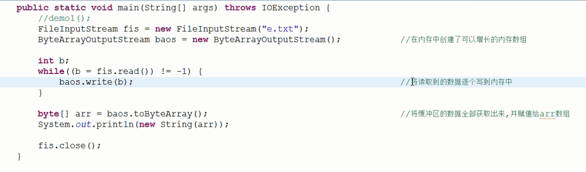

直接使用内置的码表

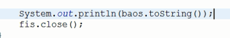

可省略toString

- 面试题
`定义一个文件输入流,调用read(byte[] b)方法,将a.txt文件中的内容打印出来(byte数组大小限制为5)`
分析

 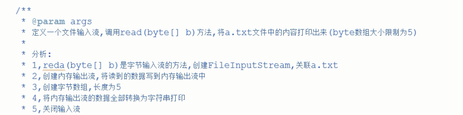

  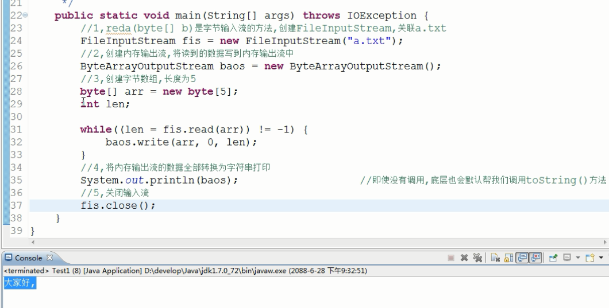

  坏处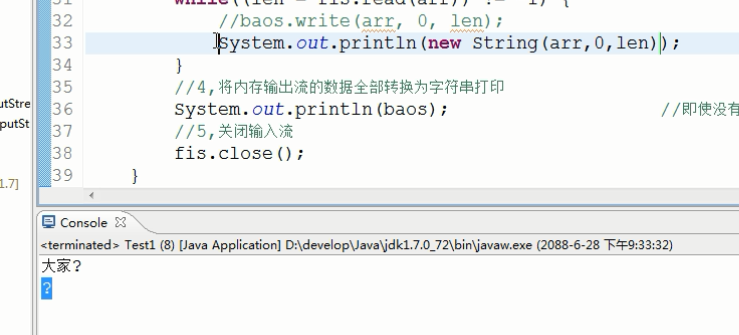

`对象操作流ObjecOutputStream` 列化和反序列化的操作 `述说什么是序列化和反序列化`
对象必须要可以实例化需要实现(implement) `serializable对象`
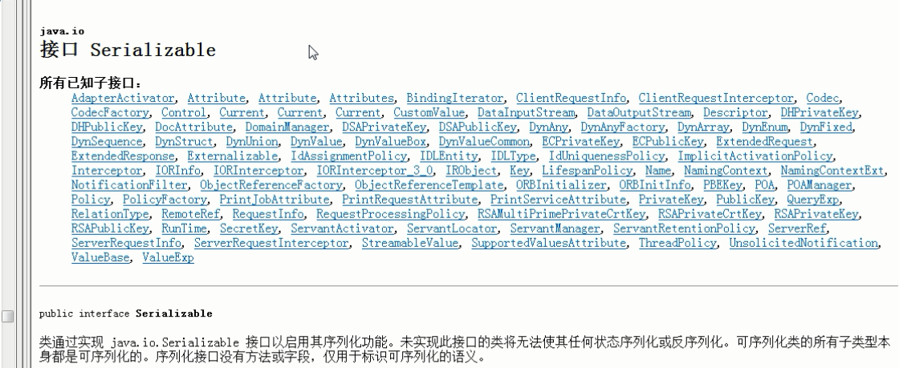

将对象转为字节数据
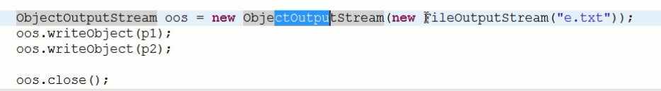
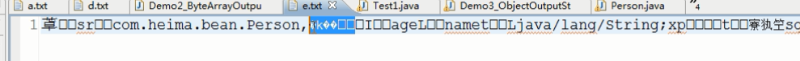

只要保证可以读出来就可以了
- 将对象读出来
`对象操作流ObjectInputStream` 对象输入流,是反序列化

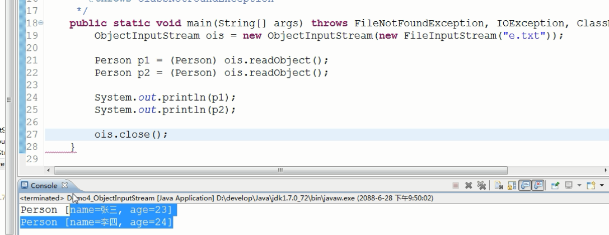

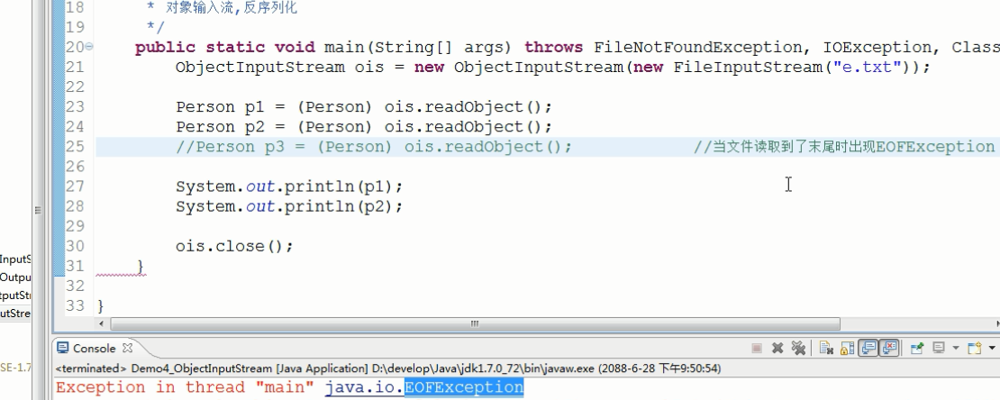

- 对象操作流优化
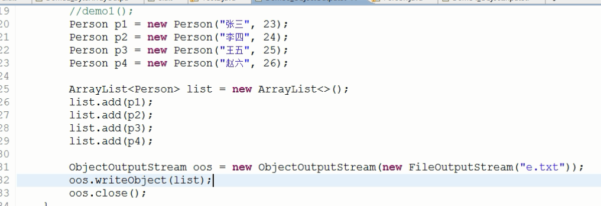
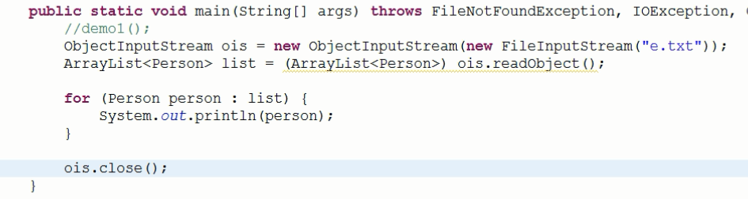
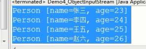
-- 

- IO流(加上id号)
要写出的对象必须实现Serializable接口才能被序列化
不用必须加id号建议加上

- 打印流
`System.out就是一个PrintStream `
`PrintStream ps = System.out; `syso`由来查看api
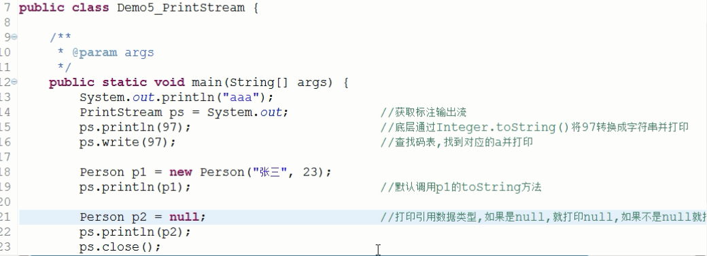
`PrintWriter`自动刷新`没有用`
- 标准输入输出流
` System.in`是InputStream, 标准输入流, 默认可以从键盘输入读取字节数据
 `System.out`是PrintStream, 标准输出流, 默认可以向Console中输出字符和字节数据

 - BufferedReader的readLine方法。

- 练习

修改标准输入输出流拷贝图片(开发不推荐使用)
- 随机访问流概述和读写数据
`RandomAccessFile`概述
read(),write(),`seek()`可以提及高下载效率在指定位置设置指针
- 数据输出输入流用的很少

- Properties 

## 整理

---

# 总结