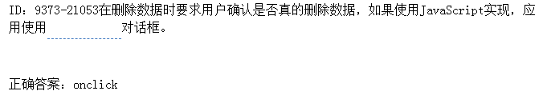
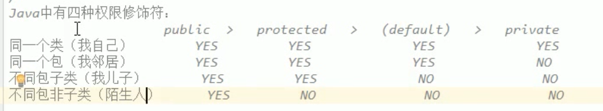
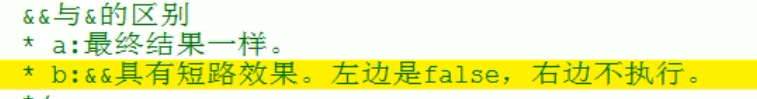

# Web
## 填空题
1. HTTP协议中，表示一切正常，返回的是正常处理结果的响应状态码是`200`
- 如果服务器上不存在所请求资源，返回的响应状态码是`404`。

知识解析

```html
100：继续  客户端应当继续发送请求。客户端应当继续发送请求的剩余部分，或者如果请求已经完成，忽略这个响应。

101： 转换协议  在发送完这个响应最后的空行后，服务器将会切换到在Upgrade 消息头中定义的那些协议。只有在切换新的协议更有好处的时候才应该采取类似措施。

102：继续处理   由WebDAV（RFC 2518）扩展的状态码，代表处理将被继续执行。

200：请求成功      处理方式：获得响应的内容，进行处理

201：请求完成，结果是创建了新资源。新创建资源的URI可在响应的实体中得到    处理方式：爬虫中不会遇到

202：请求被接受，但处理尚未完成    处理方式：阻塞等待

204：服务器端已经实现了请求，但是没有返回新的信 息。如果客户是用户代理，则无须为此更新自身的文档视图。    处理方式：丢弃

300：该状态码不被HTTP/1.0的应用程序直接使用， 只是作为3XX类型回应的默认解释。存在多个可用的被请求资源。    处理方式：若程序中能够处理，则进行进一步处理，如果程序中不能处理，则丢弃

301：请求到的资源都会分配一个永久的URL，这样就可以在将来通过该URL来访问此资源    处理方式：重定向到分配的URL

302：请求到的资源在一个不同的URL处临时保存     处理方式：重定向到临时的URL

304：请求的资源未更新     处理方式：丢弃

400：非法请求     处理方式：丢弃

401：未授权     处理方式：丢弃

403：禁止     处理方式：丢弃

404：没有找到     处理方式：丢弃

500：服务器内部错误  服务器遇到了一个未曾预料的状况，导致了它无法完成对请求的处理。一般来说，这个问题都会在服务器端的源代码出现错误时出现。

501：服务器无法识别  服务器不支持当前请求所需要的某个功能。当服务器无法识别请求的方法，并且无法支持其对任何资源的请求。

502：错误网关  作为网关或者代理工作的服务器尝试执行请求时，从上游服务器接收到无效的响应。

503：服务出错   由于临时的服务器维护或者过载，服务器当前无法处理请求。这个状况是临时的，并且将在一段时间以后恢复。
————————————————
版权声明：本文为CSDN博主「running boy」的原创文章，遵循 CC 4.0 BY-SA 版权协议，转载请附上原文出处链接及本声明。
原文链接：https://blog.csdn.net/qq_32616315/article/details/78178252
```
1. 在删除数据时要求用户确认是否真的删除数据，如果使用JavaScript实现，应用使用`onclick`对话框。

3. AJAX中，常用的数据传输格式分别为`Json`或者`XML`和`html`。
## 选择题
4. 禁止表格格子内的内容自动断行回卷的HTML代码是`<td nowrap>`？
```html
A:<tr valign=?> <!-- valign 属性规定表格行中内容的垂直 -->
B:<td colspan=#> <!--横向合并单元格-->
C:<td rowspan=#> <!--上下合并-->
D:<td nowrap> <!--表格单元格中的内容不换行-->
```


5. 下列哪一项是"多选式选单"的语法？`A. <SELECT MULTIPLE>`
```html
A. <SELECT MULTIPLE>  <!--正确答案-->
B. <SAMP></SAMP>
C. <ISINDEX PROMPT="***">
D.<TEXTAREA WRAP=OFF|VIRTUAL|PHYSICAL></TEXTAREA>
```

6. 在CSS中下列哪一项是“左边框”的语法`C:border-left：<值> `？
```html
A:border-left-width：<值>
B:text-decoration：<值>
C:border-left：<值>  <!--答案-->
D:border-top-width：<值>
```

7. 在HTML中引用外部JavaScript文件中的正确代码为？
`A:<SCRIPT type="text/javascript"src="calendar.js"></SCRIPT`
```html
A:<SCRIPT type="text/javascript"src="calendar.js"></SCRIPT> <!--答案-->
B:<SCRIPT type="text/javascript"href="calendar.js"></SCRIPT>
C:<SCRIPT type="text/javascript"import="calendar.js"></SCRIPT>
D:<SCRIPT type="text/javascript"name="calendar.js"></SCRIPT>
```

8. 用来设定背景颜色的HTML标记是。（`C:<body bgcolor="yellow">`）
   

```html
A:<background>yellow</background>
B:<body color="yellow">
C:<body bgcolor="yellow">
D:<body backgrondcolor="yellow">
```

9. 用来实现换行的HTML标记是。（`<br>`）

```html
A:<break>
B:<lb>
C:<br>
D:<return>
```

10.  在页面上打印出“Hello World”的lavaScript 语法是。（`A: document. write("Hello World")`）

```html
A: document. write("Hello World")
B: response. write("Hello World")
C:"Hello World"
D:("Hello World")
```

11. 实现一个多行文本输入域的HTML代码是。（`C:<textarea>`）

```html
A:<input type="textarea">
B:<input type="textbox">
C:<textarea>
D:<textbox>
```

12. 在HTML中，插入图片的HTML代码是。（`B:`）

```html
A:
B:
C:<image src="image.gif">
D:image.gif</img>
```

13. 在HTML中，设置背景图片的HTML代码是。（`A:<body background="background.gif">`）

```html
A:<body background="background.gif">
B:<background img="background.gif">
C:
D:<background src="background.gif">

```

14. CSS这个缩写名词所代表的具体含义是。（`A:Cascading Style Sheets `）

```html
A:Cascading Style Sheets 
B:Creative Style Sheets
C:Computer Style Sheets 
D:Colorful Style Sheets
```

15. 在弹出的alert文本框中，实现显示"Hello World”的JavaScript 语句是。`A:alert("Hello World")`

```html
A:alert("Hello World")
B:alertBox="Hello World"
C:alertBox("Hello World")
D:msgBox("Hello World")
```

16. 使用JavaScript 打开一个名为“window2“窗口的选项是。（`B:window.open("http://www.w3schools.com","window2")`）

```html
A:open.new("http://www.w3schools.com","window2")
B:window.open("http://www.w3schools.com","window2")
C:new.window("http://www.w3schools.com","window2")
D:new("http://www.w3schools.com","window2")
```

17. 在JavaScript中，实现调用一个名为“myFunction”函数的选项是。`B:myFunction()`

```html
A:call myfunction()
B:myFunction()
C:call function myFunction 
D:callmyFunction
```

18. 实现一个checkbox多选选项的HTML代码是。（`A : <input type="checkbox"> `）

```html
A : <input type="checkbox"> 
B: <in put type= "check">
C: <check> 
D: <checkbox>
```

19. 实现一个单行文本输入域的HTML 代码是。( `D: <input type=text">`)

```html
A: <input type="textfield"> 
B: <textfield>
C: <textin put type="text"> 
D: <input type=text">
```

## 判断题
1.  在HTML文档中，引入外部CSS文件是<body>段中。(`错` )


2.  需要将文字的字体显示为斜体， 正确的HTML标记是<italic>. (`错`)


3.  在JavaScriptmyFunction. (中创建一个JavaScript)
函数的方式是function(`错`)


23. 实现一个列表以数字作为编号的HTML 标记是`<ul> `(`错`)

24. 需要显示最大的标题文字，正确的HTML 标记是`<h1>`. ( `对`)

# Jave基础

## 选择题
1. 下列语句哪一个正确( `B. Java 程序经编译后会产生byte code`)

```java
A. Java 程序经编译后会产生machine code
B. Java 程序经编译后会产生byte code
C. Java 程序经编译后会产生DLL
D. 以上都不正确
```
**解析**:

bytecode（字节码文件），也就是.class文件

machine code是机器码

DLL(Dynamic Link Library)文件为动态链接库文件，又称“应用程序拓展”，是软件文件类型

2. 下列对继承的说法，哪个是正确的? ( `B. 子类能继承父类的非私有方法和状态`)
```java
A. 子类能继承父类的所有方法和状态
B. 子类能继承父类的非私有方法和状态
c.子类只能继承父类public 方法和状态
D. 子类只能继承父类的方法，而不继承状态
```

3. 下列哪一种叙述是正确的(`D. 声明抽象方法不可写出太括号` )
```java
A. abstract 修饰符可修饰字段、方法和类
B. 抽象方法的body 部分必须用一对大括号{}包住
C. 声明抽象方法， 大括号可有可无
D. 声明抽象方法不可写出太括号
```
**解析**:

abstract不能修饰字段.既然是抽象方法,当然是没有实现的方法,根本就没有body部分.

4. 在Servlet 处理请求的方式为(`C. 以线程的方式 `)
```java
A. 以进程的方式
B . 以程序的方式
C. 以线程的方式//Servlet容器默认是采用单实例多线程的方式处理多个请求的
D. 以响应的方式
```

5. JDBC中，用于表示数据库连接的对象是( `B. Connection`)

```java
A. Statement//连接的实例，执行sql
B. Connection//建立与数据库的连接
C. DriverManager//该方法将建立与数据库的连接
D. PreparedStatement
```

6. 用于调用存储过程的对象是( `C. CallableStatemet`)
```java
A. ResultSet
B. DriverManager
C. CallableStatemet
D. PreparedStatement
```

7. 按照MVC 设计模式， JSP 用于实现( `B. View`)

```java
A. Model
B. View
C. Controller
D. 容器
```

8. 在J2EE 中属于Web 层的组件有(`A. Servlet` )
```Java
A. Servlet
B. EJB
C Applet
D. HTML
```

9. 在Servlet 的生命周期中，容器只调用一次的方法是
(`c. init`)
```Java
A. servlce
B. getServletConfig
c. init
D. destroy
```
10.  执行如下程序代码

```java
a=O;c=O;
do{
--c;
a=a-1;
}
while(a>O);
```
后， c 的值是(`C. -1 `)
```java
A. 0 
B. 1 
C. -1 
D. 死循环
```
**解析**

要区分do{}while();跟while(){}的用法,do{}while();语句,无论条件是什么,都至少会执行一次 do里面的语句.执行了一次才用while去比较条件是否成立,不成立退出.而while()是条件如果不成立就不会执行里面的语句.


11. 指出下列程序运行的结果(`B. good and gbc` )

```java
public class T1_ 4 {
    String str = new String("good");
    char[] ch = { 'a', 'b', 'c' };

    public static void main(String args[]) {
    T1_ 4 ex = new T1_ 4();
    ex.change(ex.str,ex.ch)
    System.out.print(ex.str+"and");
    System.out. print( ex.ch);
}
public void change(String str, char ch(]) {
    str = "test ok";
    ch(O] = 'g';
    }
}
```

```java
A. good and abc
B. good and gbc
c. test ok and abc
D. test ok and gbc

```
**解析**
```java

public class Example{ // 我来分析一下内存分配情况吧！
String str= new String("good");
//String str 时,把str引用放在栈空间，值为null , 当new String 时 ，在堆空间生成一个 good ,并且Str指向它！
char[]ch={'a','b','c'};
//char[]ch 时,把ch 引用放在栈空间，在堆空间生成一个数组 a,b,c 并且ch 指向它们
public static void main(String args[]){
Example ex=new Example();
//Example ex 时,把 ex 引用放在栈空间， 当new Example 时 ,
//在堆空间生成一个对象 并且 ex 指向它 ，没有任何属性值，因为你没有写构造函数
ex.change(ex.str,ex.ch);
// 调用 方法 ，看方法分析！
System.out.print(ex.str+"and");
System.out.print(ex.ch);}
public void change(String str,char ch[]){
// 可能这里你会误会 ，这里的str 不同于 外面的 str ,
// 这里的意思是, String str 在栈空间 '新建' 一个str ， 其实那里已有一个 str ，就是上面那个
// 他们两个并不一样 ，这个str 是局部变量,依赖于方法 , 只要方法结束，它就自动消亡，而外面那个还在，
// 所以这里就是 ，把外面的 str 传进来，把值赋给 这个 str ，此时两个都是 ''good''
// 而char [] 分析则不同 ，
// 请先 记住 ，ch [0]，ch[1] ,ch[2] ...都是存在堆空间的 ，即是他们的地址空间，
// 对于这种引用类型的变量（例如数组，对象）,他们其实是把传进来的值直接放在引用地址.
// 即 ch[0] 始终只有一 个，并且指向堆空间，参数传进来也是在堆空间里面。
str="test ok";
// 然后执行这一步时 ， 这里面的str值就变化了 ，即变为 test ok ， 请记住此时在栈空间是有两个 str 哦
// 外面依然是 good , 可里面的 变成 test ok , 好的 ，继续 ...
ch[0]='g';
// 据上面分析，很显然 ， ch[0] 始终是一个 ，并且存放和修改都是直接在堆空间， 所以这里ch[0]变成 'g'
} // 好，这个方法终于运行结束 ， 重点来了， 到这里 谁 死掉了 , 就是这里面那个 依赖于方法存在的局部变量 str
// 那么现在一共就只有一个 str ，并且它的值为 good ,当接下去控制台输出的时候调用 str ，
// 你说还会调用那个死了的 str 吗， 显然 调用 还存在的 str 即是 good
}
// 其实 , 假如想看明白，你可以这样 ， 把方法里面的 str , 改为 this.str .
// 你就能够区分 : 原来他们真是 两个 str ，而使用 this （本类) 调用的才是成员变量!
// 不依赖方法 ，就是命硬 ， 死不了 ！

```
12. 看下面一段程序:

```java
class Aclass{
    void go(){
    System .out. pri ntln(" Aclass");
    }
}
public class Bclass extends Aclass{
    void go{
    ystem.out. println(" Bclass");
    }
public static void mai 叫String args(]){
    Aclass a=new Aclass();
    Aclass a1=new Bclass();
    a.go();
    a1.go();
```
以上程序运行结果是: (`C. Aclass Bclass` )
```java
A. Aclass Aclass
B. Bclass Bclass
C. Aclass Bclass
D. Bclass Aclass
```
## 多选题

1. 下面哪些代码片段会产生编译错误? (`B`和`D` )

```java
A. 
String s = "Gone with the wind"; 
String t = " good ";
String k = s + t;
B. 
String s = "Gone with the wind"; 
String t; t = s[3] + "one";
c. 
String s = "Gone with the wind"; 
String 5tandard = s.toUpperCase();
D. 
String s = "home directory"; 
String t =s-"directo ry";
```

2. 给定下面的代码片段:

```java
public void Test() {
try {
    methodO;
    System.out.println(" Hello World");
}

catch (ArraylndexOutOfBound5Exception e)
    System.out.println(" Exception ?");
}
catch(Exception e)
    System.out.println(" Exception 1 ");
finally{
    System.out.println("Thank you! ");
}
}

```
如果函数method 正常运行并返回，会显示下面的哪些信息?  (`A. Hello World` `D. Thank you!` )
```java
A. Hello World
B. Exception
C. Exceptionl
D. Thank you!
```

3. 下面关于Java 代码安全的说法哪些是正确的? ( `A` `C` `D`)
```java

A. 程序执行过程中需要的所有类都是通过字节码校验程序装入的.
B. 代码的运行是由Java 运行环境中的解释器完成的。
c. 在运行时， 字节码要经过装入， 校验之后，才能在解释器中执行。
D. 在缺省的安全配置条件下， Java Applet 不能访问任何本地资掘。
```
4. 下列方法属于java.lang.Math 类的有(方法名相同即可) : ( `ABCD`)
```java
A. random()
B. abs()
C. sqrt()
D. sin()
```

5.`DE` 
```java
class Person {
pnvatemt a;
publicint change(int m){ 
    return m; 
    }
public c1ass Teacher extends Person {
    public int b;
}
public static void main(5tring arg[]){
    Person p = new Person();
    Teacher t = new Teacher();
ínt i;
// point x
    }
}
Which are syntactically valid statement at/ / point x?(`DE`)
```java
A. i = m;
B. i = b;
C. i = p.a;
D. i = p.change(30);
E.i = t.b.
```
# 简答题
1. 作用域`public` , `private`, `protected` ，以及不写时的区别?
```java
(1) private修饰的成员变量和函数只能在类本身和内部类中被访问。
(2)	protected 修饰的成员变量和函数能被类本身、子类及同一个包中的类访问。
(3) public修饰的成员变量和函数可以被类、子类、同一个包中的类以及任意其他类访问。
(4)	默认情况（不写-default）下，属于一种包访问，即能被类本身以及同一个包中的类访问。
```

2. `Anonymous` `Inner` `Class` ( 匿名内部类) 是否可以`extends` (继承) 其它类，是否可以`implements` (实现)`interface` (接口) ?
```java
答:不能,匿名内部类可以继承其他类，但不能用extends。可以实现某接口，但不能用implements
匿名内部类在实现时须借助一个类或接口，从这个层次上讲它是可以继承其他类也可以实现接口的，
但通过extends或implements关键字那是不可能的.
```
3. Static Nested Class 和Inner Class 的不同?
```java
Nested Class （一般是C++的说法），Inner Class (一般是JAVA的说法)。Java内部类与C++嵌套类最大的不同就在于是否有指向外部的引用上。
```
4. &和&&的区别?


//逻辑与&并且and 遇false则false
5. Collection 和Collections 的区别?
```java
collection:它属于集合框架中的一个接口，并且是顶
层接口。
Collectios 则是在集合框架中给我们提供的一个工具类，它提供了一系列静态方法实现对各种集合的搜索、排序、线程安全化等操作。
```

6. 什么时候用`assert`?

6. String s = new String( "xyz P) ;也创建了几个String Object ?
```java
一个是指向“xyx”的引用对象s
String s=new String("xyz")究竟对象个数分为两种情况：
1.如果String常理池中，已经创建"xyz"，则不会继续创建，此时只创建了一个对象new String("xyz")；
2.如果String常理池中，没有创建"xyz"，则会创建两个对象，一个对象的值是"xyz"，一个对象new String("xyz")。
```
7. Math.round (11.5)等于多少? Math. round (-11.5 )等于多少?
```java
Math.round (11.5)等于12(11.5+0.5)
Math. round (-11.5 )等于11(-11.5+0.5)
```
```java
public class Test{
    public static void main(String[] args) {
        System.out.println(Math.round(11.5));   //12
        System.out.println(Math.round(-11.5));  //-11
        System.out.println(Math.ceil(11.5));    //12
        System.out.println(Math.ceil(-11.5));   //-11
        System.out.println(Math.floor(11.5));   //-11
        System.out.println(Math.floor(-11.5));  //-12
    }
}
**总结**

```java
正数:ceil向上floor向下,round`+0.5`向下
负数:ceil向下floor向上,round`+0.5`向上后加上负号
```
```
9. short s1 = 1; s1 = s1 + 1;有什么错? short s1 = 1; s1 += 1;有什么错？
```java
对于 short s1 = 1; s1 = s1 + 1; 由于 s1+1 中的1是int类型，运算时会自动提升表达式的类型，所以s1+1结果是 int 型2，再赋值给 short 类型 s1 时，编译器将报告需要强制转换类型的错误，即需要强制转换。 
short s1 = 1; s1 += 1;中S1+=1实际上可以写成S1=(short)(S1+1)；它是先把S1+1的结果强制转换为short类型了，所以符合语法规定，正确。
```

10. Java 有没有goto?
```java
 goto是java中的保留字，现在没有在java中使用。
```

# Java编程题
1.  编写一个应用程序，创建三个线程分别显示各自的时间。
```java
package com.test;
import java.text.SimpleDateFormat;
import java.util.Date;
/**
 *    编写一个应用程序，创建三个线程分别显示各自的时间。
 * @author dj
 *
 */
public class Tset1 {
	public static void main(String[] args) {
		//创建第一个线程并执行
		new MyThread("线程1").start();
		//创建第二个线程并执行
		new MyThread("线程2").start();
		//创建第三个线程并执行
		new MyThread("线程3").start();;
	}
}
// 通过继承Thread类 来重写run方法
class MyThread extends Thread {
    //通过正则式来设置输出的时间格式
	SimpleDateFormat s = new SimpleDateFormat("yyyy年MM月dd日  HH:mm:ss");
	
    public MyThread(String string) {
		String str = s.format(new Date());
		System.out.println(string+"的时间是----"+str);
	}
	//重写run()方法
	public void run() {}
}
```
2. 有1 、2 、3 、4 四个数字，用这四个数组成四位数，编写一个程序， 统计能组成多少个互不相同且无重复数字的三位数?都是多少? 打印出来所有可能组成的三位数，并统计打印出三位数的个数。

3. 写一个算法对1 , 8, 5, 2, 4, 9, 7 进行顺序排列。

`冒号排序`
```java
package com.test;

public class Paixu {
	public static void main(String[] args) {
		int[] arr = {1,8,5,2,4,9,7};
		bubbleSort(arr);
		print(arr);
	}
	public static void bubbleSort(int[] arr) {
		for (int x = 0; x < arr.length - 1; x++) {
			for (int y = 0; y < arr.length - 1 - x; y++) {
				if (arr[y] > arr[y + 1]) {
					int temp = arr[y];
					arr[y] = arr[y + 1];
					arr[y + 1] = temp;
				}
			}
		}
	}
	public static void print(int[] arr) {
		for (int i = 0; i < arr.length; i++) {
			System.out.print(arr[i]+" ");
		}
	}
}

```