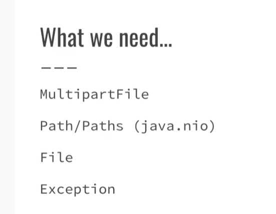
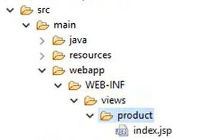

# ckeditor富文本编辑器
## 快速入门
- 下载 .zip包解压
  - 或者引包`<script src="//cdn.ckeditor.com/4.13.1/standard/ckeditor.js"></script>` 
  - 或者导入找到`ckeditor.js文件进行引入` 
    - 建议在线制作
- 加载CKEditor脚本
```js
<head>
    ...
        <script src="/ckeditor/ckeditor.js"></script>
	</head>
```

- 使用Textarea创建
```js
<textarea name="editor1" id="editor1">&lt;p&gt;Initial editor content.&lt;/p&gt;</textarea>
```
给定属性name或者id
- js部分调用即可
```js

<script>
    CKEDITOR.replace( 'editor1' );
    </script>
```

## 进行配置,主要配置文件为`config.js` 可以在CKEditor安装文件夹的根目录中找到此文件。
- 页内配置
```js
CKEDITOR.replace( 'editor1', {
    language: 'fr',
        uiColor: '#9AB8F3'
	});
```

- CKEDITOR.inline
- contenteditable="true" 表示可以编辑inline里面的属性开关或者用
- CKEDITOR.disableAutoInline=true-->首先关闭自动编辑器创建。
### 配置按钮未知和数量
- 进入CKeditor的samples/index.html-->运行起来进行编辑
- 编辑完成后获取配置文件内容粘贴至自己的配置文件config.js中
### 配置图片插件内的功能开关

## ckeditor的插件
下载后将其名称添加至config文件中
在配置文件中写上`extraPlugins = 'codesnippet' ;` 
下载地址:
- youtube插件`https://ckeditor.com/cke4/addon/youtube` 

[](-) 代码code插件`https://ckeditor.com/cke4/addon/codesnippet` 
### 修改其图片路径需要的组件


# springboot mvc启动CKeditor
引入依赖
```config

        <dependency>
            <groupId>taglibs</groupId>
            <artifactId>standard</artifactId>
            <version>1.1.2</version>
        </dependency>

        <dependency>
            <groupId>commons-fileupload</groupId>
            <artifactId>commons-fileupload</artifactId>
            <version>1.4</version>
        </dependency>
        <dependency>
            <groupId>javax.servlet</groupId>
            <artifactId>javax.servlet-api</artifactId>
            <version>4.0.1</version>
            <scope>provided</scope>
        </dependency>
        <dependency>
            <groupId>org.apache.tomcat.embed</groupId>
            <artifactId>tomcat-embed-jasper</artifactId>
            <version>9.0.30</version>
        </dependency>
```

- 添加配置文件
```config
spring.mvc.view.prefix = /WEB-INF/views/
spring.mvc.view.suffix = .jsp
spring.mvc.static-path-pattern = resources/**
server.port = 80
```
- 按照此目录结构创建文件夹和文件类型

 
