# docker

**关键词**


---

# 笔记
## 1. docker简介
- 下载 

    [docker官网](https://www.docker.com/)

    ~~[docker中文网](XXX)~~

    [Github Docker 源码](https://github.com/docker/docker-ce)

- 仓库
  
    [dcoker hub](https://hub.docker.com/)


## 2. docker安装
### 前提说明
- CentOS Docker 安装
```md
Docker支持以下的CentOS版本：
CentOS 7 (64-bit)
CentOS 6.5 (64-bit) 或更高的版本
```
- 前提条件
```md
目前，CentOS 仅发行版本中的内核支持 Docker。
Docker 运行在 CentOS 7 上，要求系统为64位、系统内核版本为 3.10 以上。
Docker 运行在 CentOS-6.5 或更高的版本的 CentOS 上，要求系统为64位、系统内核版本为 2.6.32-431 或者更高版本。
```
- 查看自己的内核
`uname -r` `uname -a`

命令用于打印当前系统相关信息（内核版本号、硬件架构、主机名称和操作系统类型等）。
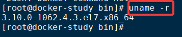

`cat /etc/ redhat-release` 

查看已安装的CentOS版本信息（CentOS6.8有，CentOS7无该命令）
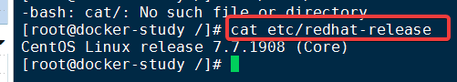
 
### Docker基本组成
- 镜像

Docker 镜像（Image）就是一个只读的模板。镜像可以用来创建 Docker 容器，一个镜像可以创建很多容器。

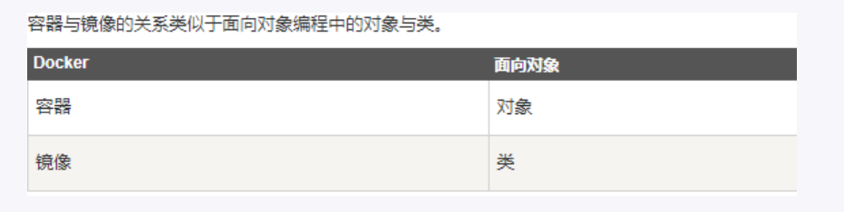

- 容器
  - Docker 利用容器（Container）独立运行的一个或一组应用。容器是用镜像创建的运行实例。
  - 它可以被启动、开始、停止、删除。每个容器都是相互隔离的、保证安全的平台。
  - 可以把容器看做是一个简易版的 Linux 环境（包括root用户权限、进程空间、用户空间和网络空间等）和运行在其中的应用程序。
  - 容器的定义和镜像几乎一模一样，也是一堆层的统一视角，唯一区别在于容器的最上面那一层是可读可写的    。

- 仓库
1. 仓库（Repository）是集中存放镜像文件的场所。

2. 仓库(Repository)和仓库注册服务器（Registry）是有区别的。仓库注册服务器上往往存放着多个仓库，每个仓库中又包含了多个镜像，每个镜像有不同的标签（tag）。

3. 仓库分为公开仓库（Public）和私有仓库（Private）两种形式。

4. 最大的公开仓库是 Docker Hub(https://hub.docker.com/)，存放了数量庞大的镜像供用户下载。国内的公开仓库包括阿里云 、网易云 等
- 总结
 需要正确的理解仓储/镜像/容器这几个概念:

 Docker 本身是一个容器运行载体或称之为管理引擎。我们把应用程序和配置依赖打包好形成一个可交付的运行环境，这个打包好的运行环境就似乎 image镜像文件。只有通过这个镜像文件才能生成 Docker 容器。image 文件可以看作是容器的模板。Docker 根据 image 文件生成容器的实例。同一个 image 文件，可以生成多个同时运行的容器实例。

 

  * image 文件生成的容器实例，本身也是一个文件，称为镜像文件。

  *  一个容器运行一种服务，当我们需要的时候，就可以通过docker客户端创建一个对应的运行实例，也就是我们的容器

  * 至于仓储，就是放了一堆镜像的地方，我们可以把镜像发布到仓储中，需要的时候从仓储中拉下来就可以了。

### docker在centos7上安装(此处是谷歌云centos7)
1. yum安装 `gcc`
```linux
yum -y install gcc

yum -y install gcc-c++
```
2.卸载旧版本
```linux
$ sudo yum remove docker \
                  docker-client \
                  docker-client-latest \
                  docker-common \
                  docker-latest \
                  docker-latest-logrotate \
                  docker-logrotate \
                  docker-selinux \
                  docker-engine-selinux \
                  docker-engine
```
3. 执行以下命令安装依赖
```md
$ sudo yum install -y yum-utils \
           device-mapper-persistent-data \
           lvm2
```
4. 国内更换源(外国服务器不需要)
```linux
# 官方源
# $ sudo yum-config-manager \
#     --add-repo \
#     https://download.docker.com/linux/centos/docker-ce.repo
# 阿里源
# yum-config-manager --add-repo http://mirrors.aliyun.com/docker-ce/linux/centos/docker-ce.repo
# 
#$ sudo yum-config-manager \
    --add-repo \
    https://mirrors.ustc.edu.cn/docker-ce/linux/centos/docker-ce.repo
```
5. 安装yum软件索引

```linux
$ sudo yum makecache fast
```
6. 安装docker ce

```linux
$ sudo yum install docker-ce
```
7. 启动docker
```linux
$ sudo systemctl enable docker
$ sudo systemctl start docker  
```

8. 测试
```linux
docker version
docker run hello-world
```
9.  配置镜像加速

```linux
mkdir-p/etc/docker #创建文件夹 -p的作用是遍历创建
vim/etc/docker/daemon.json 
systemctl daemon-reload 
systemctl restart docker
```
- daemon.json
```json
 #网易云
{"registry-mirrors": ["http://hub-mirror.c.163.com"] }
 #阿里云
{
  "registry-mirrors": ["https://｛自已的编码｝.mirror.aliyuncs.com"]
}

```
10. 卸载
```linux
systemctl stop docker 
yum -y remove docker-ce
rm -rf/var lib dcoker 
```

## 3. docker常用指令
### 帮助命令
1. `docker version`
docker版本查询
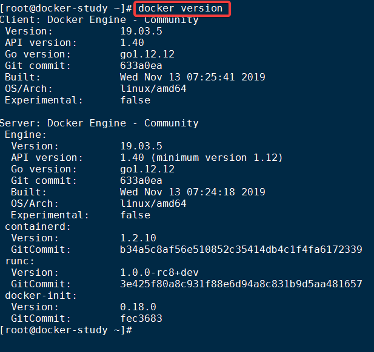
3. `docker info`
查看docker系统信息。
4. `docker --help`
### 镜像命令
1. `docker images` 

- 查出本地主机的镜像
`docker images` 
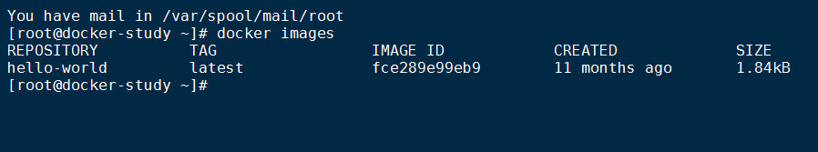
格式`dcoker images [OPTIONS]`

`-a` 列出本地所有的镜像,包含中间镜像层
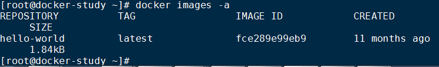
`-q` 只显示镜ID


`--digests` 显示镜像的摘要信息
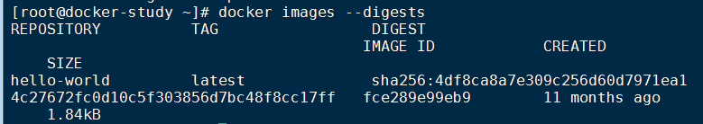
`--no-trunc`显示完整的镜像信息
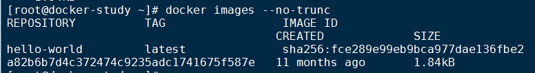
- 联网查找某个镜像的名字
[网站](https://hub.docker.com)
命令`docker search [OPTIONDS]`镜像名字
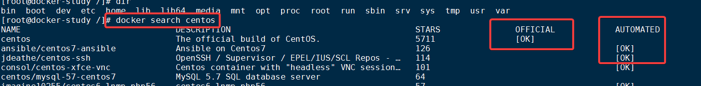
  - [OPTIONDS] `--no-trunc` 显示完整的镜像描述
  - [OPTIONDS] `-s` 列出收藏数不小于指定的镜像
  - [OPTIONDS] `--automated` 只列出automated的build类型的镜像
- docker 拉取镜像`pull`
- 
`docker pull`镜像名字[:TAG]

TAG:是版本号
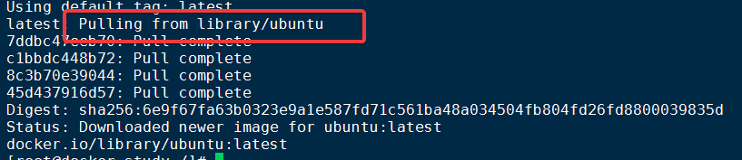
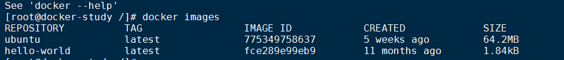
- 删除本地镜像`rmi`
  - 删除单个镜像`docker rmi -f 镜像ID`
  - 删除多个镜像`docker rmi -f 镜像1:TAG 镜像2:TAg`
  - 删除全部镜像`docker rmi $(docker images -qa)`
### 容器命令
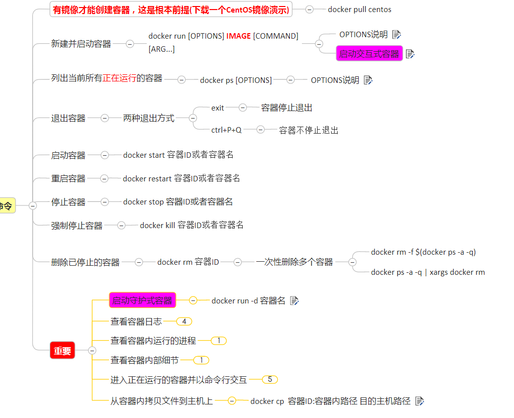
1. 有镜像才能创建容器,这是根本前提(下载一个ubuntu)`docker pull ubuntu`
2. 新建并启动容器
  - `docker run [options] iamges [command]`
  - `options` 常用
    - `--name` 取别名
    - `-d`后台运行容器,并返回容器ID,也即启动守护式容器
    - `-i`以交互是模式运行容器,通常与`-t`同时使用
    - `-t`为容器分配一个伪输入终端,通常与`-i`同时使用
    - `-P` 随机端口映射
    - `-p` 指定端口映射
      - `ip:hostPort:containerPort`
      - `ip::containerPort`
      - `hostPort:containerPort`
      - `containerPort`
  `docker run -it centos /bin/bash `
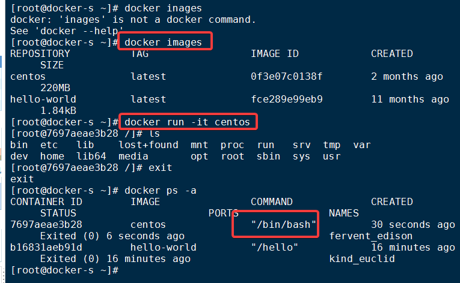
2. 列出所有当前正在运行的容器

`docker ps [options]`
options说明
`-a` 列出正在运行个历史运行的所有容器
`-l` 列出最近创建的容器
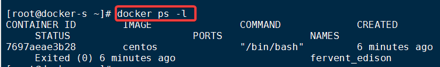
`-n` 显示最近创建的的容器
`-q` 只显示但是的容器对应的id
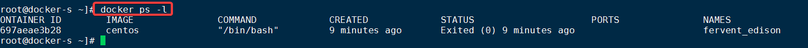
3. 退出容器
   1. `exit`
   2. `ctrl+p+q`
4. 启动容器
   1. `docker start 容器id或容器id名`
5. 重启容器
   1. docker restart 容器id或者容器名
6. 停止容器
   1. `docker stop 容器id或容器名`
7. 强制停止容器
   1. `docker kill 容器Id或容器名称`
8. 删除已停止的容器
   1. `docker rm 容器ID
      1. 一次性删除多个容器
         1. `docker rm -f ${docker ps -a -q}`
         2. `docker ps -a -q|xargs dcoker rm`
9. 重点
   1.  查看容器内容日志(`docker logs -f -t --tail 容器ID`)
       1.  `-t` 是加入时间戳
       2.  `-f` 跟随最新日志打印
       3.  `--tail` 数字显示最后多少条
   2. 进入正在进行的的容器
      1. docker exec -it 容器ID bashshell
       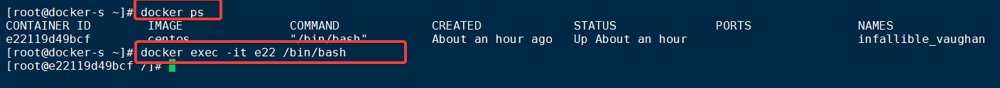
      2. docker attach 容器id
      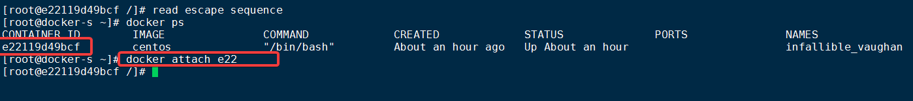
   3. 拷贝内容
      1. docker cp 容器ID:容器内容 拷贝到主机的位置
      2. docker cp 主机位置 容器Id 拷贝到的容器位置


## 4. docker镜像
1. 下载tomcat并跑起来
   1. `docker run -it -p 80:8080 tomcat`
      1. `-p` 主机端口号:docker容器端口好
      2. `-P` 随机分配端口
   2.  `docker run -it -P tomcat`
    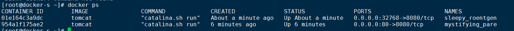

## 5. docker容器卷
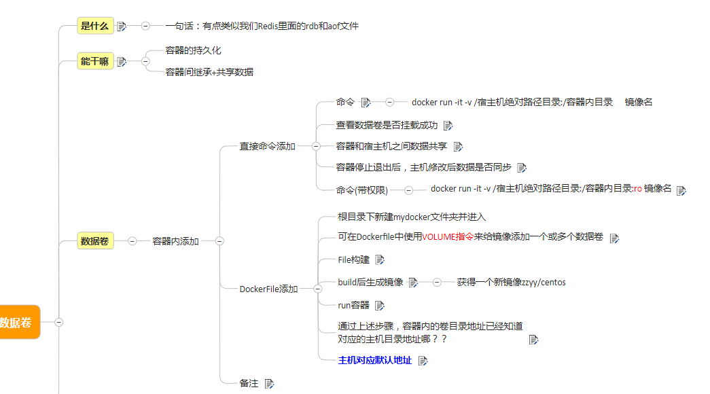
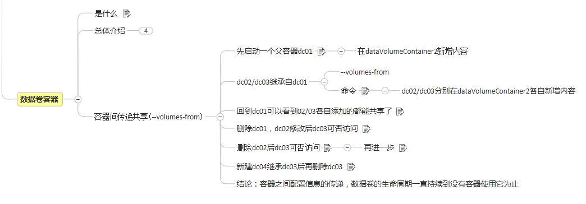
## 6. dockerFile解析
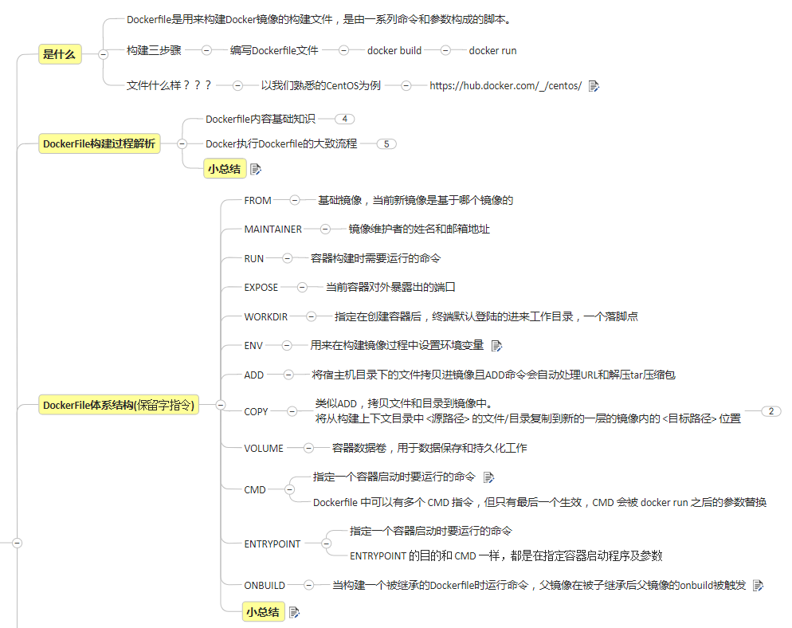
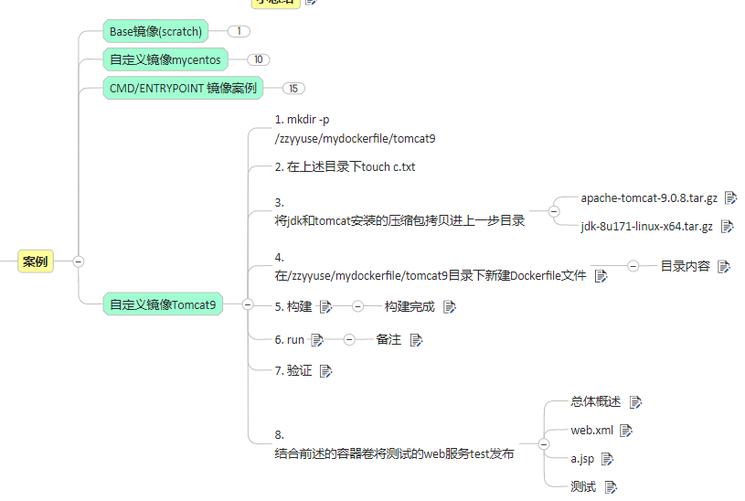
## 7. docker常用安装
1. tomcat 的安装
   1. `docker search tomcat` 查找镜像
   2. `docker pull tomcat`云端拉取镜像
   3. `docker images` 查看本地镜像
   4. `docker run -it -p 8080:8080 tomcat`
      1. `-i` 交互
      2. `t` 终端
      3. `-p` 指定端口
      4. `-P` 随机分配端口
2. mysql的安装
   1. `docker run -p 3306:3306    --name mysql -v /zzyyuse/mysql/conf:/etc/mysql/conf.d     -v /zzyyuse/mysql/logs:/logs     -v /zzyyuse/mysql/data:/var/lib/mysql     -e MYSQL_ROOT_PASSWORD=root     -d  mysql:5.6`
      1. `-p` 12345:3306：将主机的12345端口映射到docker容器的3306端口。
      2. `--name mysql`：运行服务名字
      3. `-v /zzyyuse/mysql/conf:/etc/mysql/conf.d` ：将主机/zzyyuse/mysql录下的conf/my.cnf 挂载到容器的 /etc/mysql/conf.d
      4. `-v /zzyyuse/mysql/logs:/logs`：将主机/zzyyuse/mysql目录下的 logs 目录挂载到容器的 /logs。
      5.  `-v /zzyyuse/mysql/data:/var/lib/mysql` ：将主机/zzyyuse/mysql目录下的data目录挂载到容器的 /var/lib/mysql 
      6. `-e MYSQL_ROOT_PASSWORD=123456`：初始化 root 用户的密码。
      7. `-d mysql:5.6` : 后台程序运行mysql5.6
3. 
## 8. 本地镜像发布到阿里云
## docker-compose文件

## 补充学习
### 指令记录
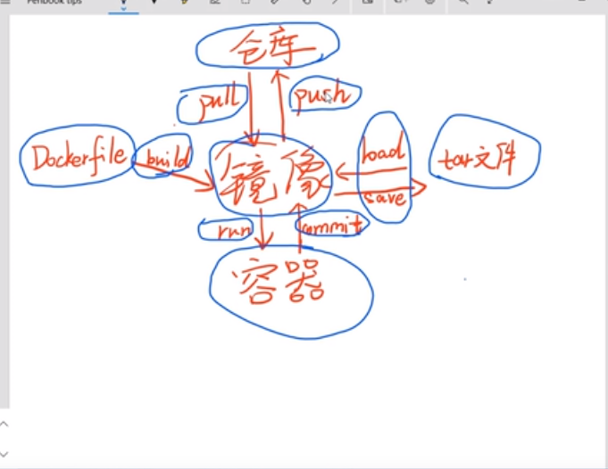
1. docker pull nginx
2.  docker images
3.  docker run Nginx -d -p 80:80 
4.  docker exec -it `34容器id` bash
5.  cd /usr/share/nginx/html/
    1.  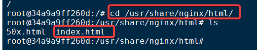
6.  echo hello >index.html
    1.  cat index.html
    2.  
7.  exit
8.  docker -rm -f `容器id`
9.  docker commit `容器id` `名字`
    1.  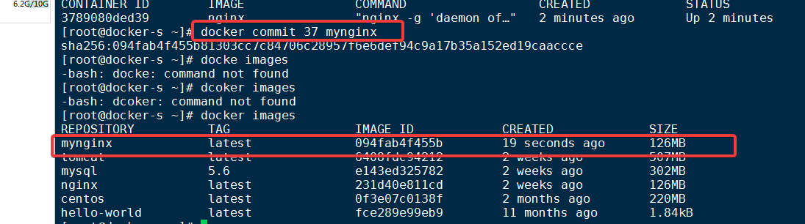
10. docker run -d -p 90:80 `名字`
11. vim Dockerfile
    1.  FROM nginx
    2.  ADD ./ usr/share/nginx/html
12. vim index
    1.  随便写点内容!!!
13. docker build -t m2 `.`
    1.  `.`为当前目录下的dockerfile文件
     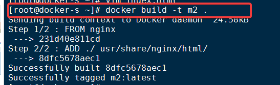
14. docker run -d -p100:80 m2
     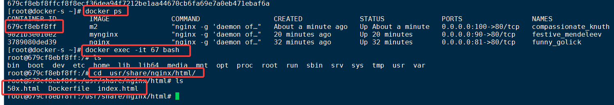
15. docker save `容器名称` > 1.tar
    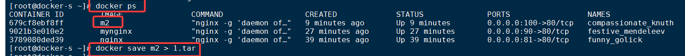
16. ls
    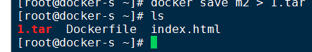
17. docker ps
    1.  docker rm -f `容器id`
    1. docker rmi `镜像名称`
    2. 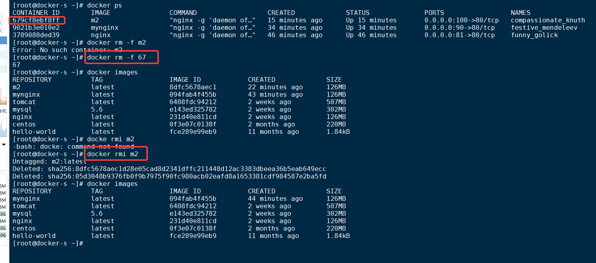
18. docker load < 1.tar
  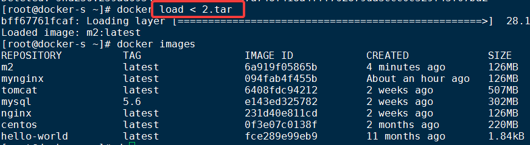
19.  docker run -d -p 88:80 --name mysnginx -v `pwd`:/usr/share/nginx/html nginx
---
## 实际项目中编排docker
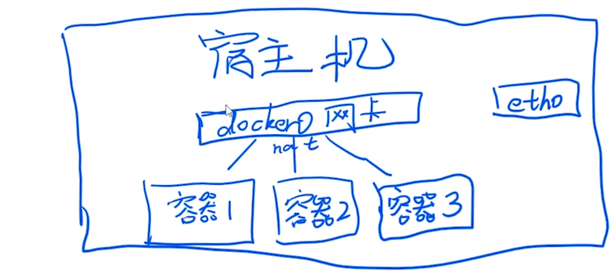
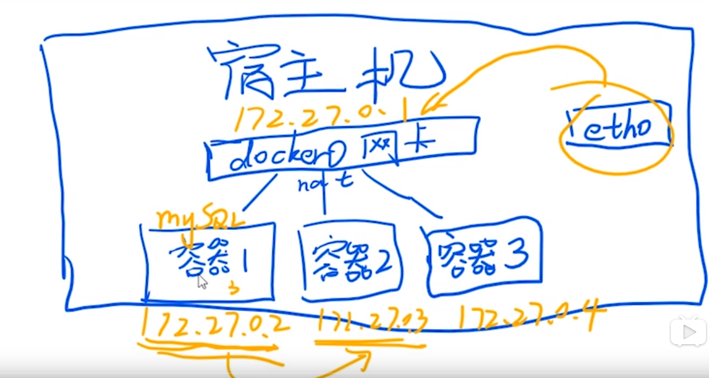
1. docker run -d -p 80:80 --name mynginx nginx
2. docker exec -it mynginx bash
   1. ifconfig
   2. cat etc/hosts
   3. 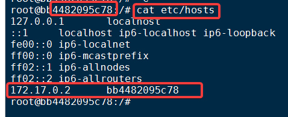
3. exit
4. docker run -dit alpine
   1. `alpine`最小的linux系统
5. docker exec -it 26 sh
   1. apk add curl(安装curl)
   2. curl 172.17.0.2
   3. 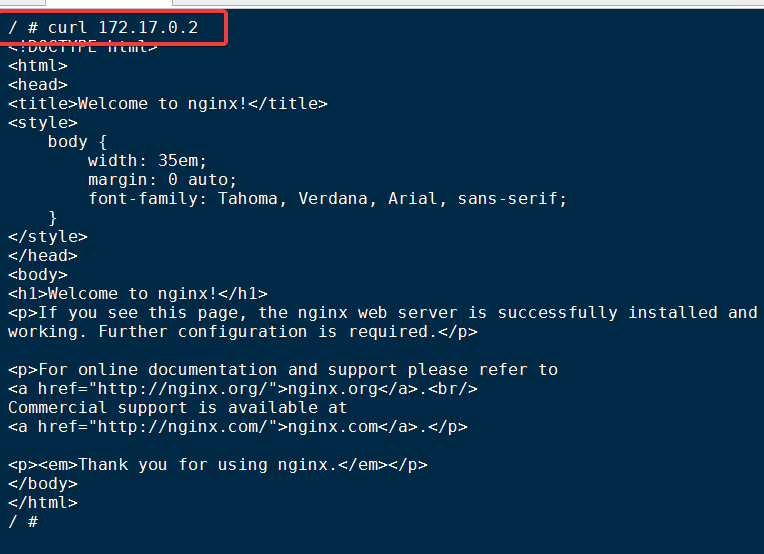
6. 真正生产过程的通信(--link通过解析到对应机子)
   1. docker ps
   2. docker rm -f $(docker ps -aq)
   3. docker run -d -p80:80 --name myng nginx
   4. docker run -dit --link myng:myng alpine
   5. dcoker exec -it `容器id` sh
   6. apk add curl
   7. curl myng
      1. 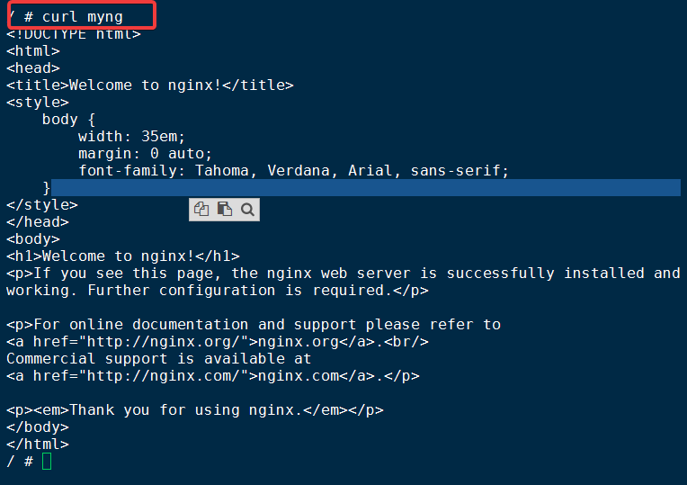
   8. 原理是通过修改/etc/hosts文件实现域名解析
      1. 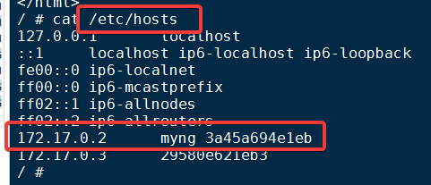
   9. exit
7.   通过docker-compose配置
     1.   
     2.   安装docker-compose
          1.   yum -y install docker-compose
8.   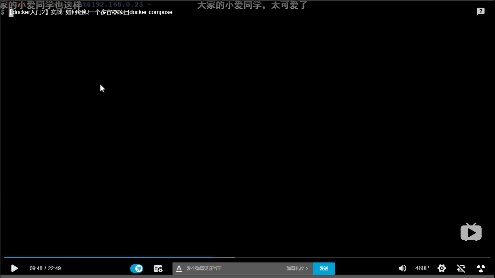
9.  创建目录
    1.  mkdir conf
    2.  mkdir html
    3.   cd html
         1.   vim index.html
              1.   index html 
         2.  vim test.php
             1.  `<?php phpinfo();`
         3. vim mysql.php
          ```php
            <?php
            $dbhost = 'localhost';  // mysql服务器主机地址
            $dbuser = 'root';            // mysql用户名
            $dbpass = '123456';          // mysql用户名密码
            $conn = mysqli_connect($dbhost, $dbuser, $dbpass);
            if(! $conn )
            {
            die('Could not connect: ' . mysqli_error());
            }
            echo '数据库连接成功！';
            mysqli_close($conn);
            ?>
            ```

            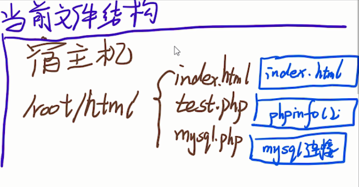 
        4. cd ../conf/
        5. vim nginx.conf
           1. ng的配置文件拷入
           2. 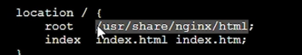
           3. 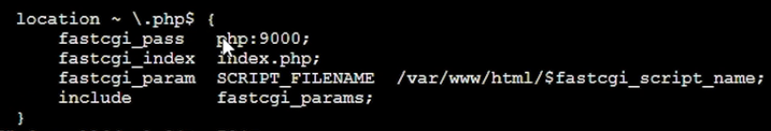
           4. 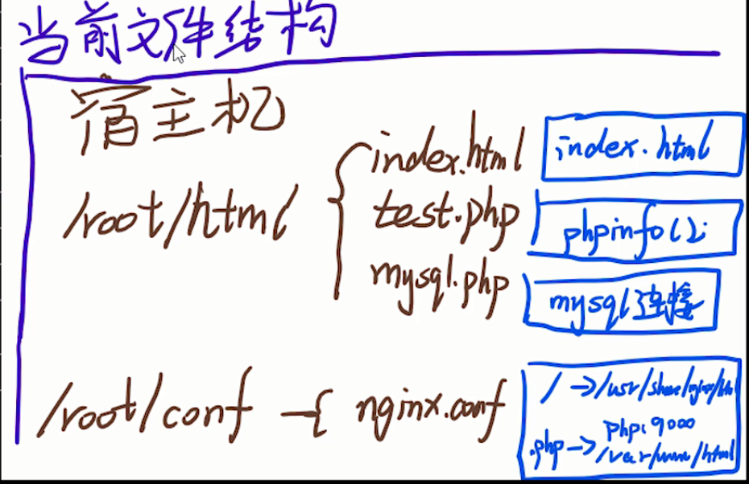
           
        6. 到根目录新建docker-compose
           1. vim docker-compose.yml
            ```yml
                version:"3"
                services:
                    nginx:
                    image: nginx:alpine
                    ports:
                    - 80:80
                    volumes:
                    - /root/html:/usr/share/nginx/html
                    - /root/conf/nginx.conf:/etc/nginx/nginx.config
                php:
                    image: devilbox/php-fpm:5.2-work-0.89
                    volimes:
                    - /root/html:/var/www/html
                mysql:
                    image:mysql:5.6
                    environment:
                    - MYSQL_ROOT_PASSWORD=123456

            ```

           2. docker-compose up -d
           3. 测试
              1. 访问80端口加载出index html的内容
              2. 访问test.php返回php文件的内容
              3. mysql.php测试数据库是否成功
                 1. 修改mysql.php文件内的服务器地址是否正确
## 总结
docker的学习告一段落,希望自己后期能把此教程的环境搭建一下,把它测通,所缺少的是nginx的基础知识 
