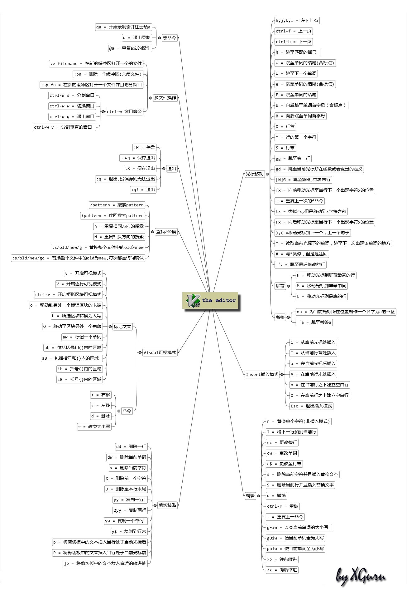
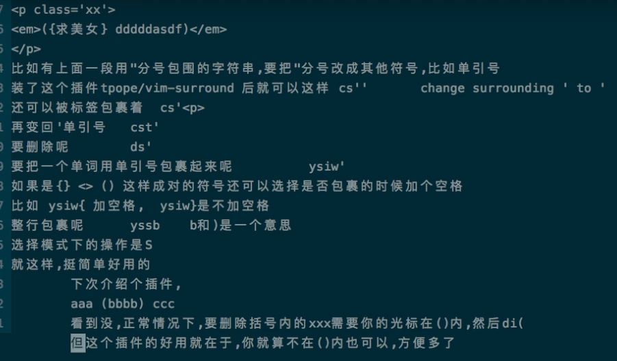

# vim 操作



## vim的vimrc配置文件的使用
- linux的配置文件的位置`~/.vim/.vimrc`文件
- `：source $MYVIMRC` 刷新vim
- `jkhl` 上下左右
- `：split` 上下分屏 、：vsplit 左右分屏 Q退出
- `~/.vim/vimrc`
- `noremap` a b a键改b键    
- `map a b` a键改b键
- `syntax on` 打开高亮
- `set number` 显示行号
- `set wildmenu` ：命令补全
- `set hlsearch`/搜索高亮
- `set incsearch`一面输入一面高亮
- `set ignorecase`忽略大小写43：35美化！
---
## 基本操作
【y i c d f 】
- esc 回到正常模式
- 在vim中一共分为3种模式
###  normal 正常模式
- `d + ←→`删除光标←→字符（d +3←）、dd删除一行（其实是剪切，p粘贴）
- `y+ ←→`复制光标←→字符 （y+3←）
- `c` 删除并进入写入模式、w 光标向下移动一个词、cw删除一个词并进入写入模式、b光标到上一个词 、ciw词中删除一个词并进入写入模式，yi
- `^` 查找到最近空白字符前
- `f` 找词
- `/` 搜索、n下 N上
### insert 插入模式
- `a`插入之后
- `A`行尾插入
- `i`插入之前
- `I`行首插入
- `o`下行插入
- `O`上行插入
### visuarl 可视模式
`：w`保存
`：q`退出vim
## vim 配合vscode使用
### 插件``的使用
### vim 骚操作
1. 将当前文件夹下的文件名列在文档内
`:r !ls` 


2. 选择中要写入的块内容`Ctrl+v` `GG`移动到行尾 `:`写入内容
块命令

`normal I写入的的内容`

`normal 插入行首的内容`

实现数字自增需要用`ctrl+A`
### vim需要记忆的操作
1. 删除到指定位置`df+位置`

---

# vscode-vim
vscode中vim使用技巧

 `cs"'` 替换双引为单引号

    "Hello world!"

to change it to

    'Hello world!'

`cs'<q>` 

    <q>Hello world!</q>

 `cst"`

    "Hello world!"

`ds"`删除双引号

    Hello world!

`ysiw]` (`iw` is a text object).用指定的符号包裹单词

`ys2aw(`使用`(`包裹2个单词

    [Hello] world!

Let's make that braces and add some space (use `}` instead of `{` for no
space): `cs]{`

    { Hello } world!

`yssb` or `yss)`.

    ({ Hello } world!)

`ds{ds)`

    Hello world!

 `ysiw<em>`

    <em>Hello</em> world!
    

## 模式切换:

1. 按esc键进入normal模式

2. 在normal模式中可以使用hjkl移动光标

3. 按下i键进入插入(文本编辑模式)

4. 在noraml模式中，按下v进入可视模式

## 移动光标

h 向左移动

j 向下移动

k 向上移动

l 向右移动

## 快速移动

gg 移动到文件第一行 *

G 移动到文件最后一行 *

$ 移动到行末

0 移动到首

w 下个单词的词首

b 上个单词的词首

gE 上个字符串的结尾 * 

E 下个字符串的结尾 *

:n 移动到第n行

x 删除一个字符

dw 删除当前单词到行末

dd 删除一张行

zc 代码折叠
zo 打开代码折叠

< 向左缩进

\> 向有缩进

## 切换已经打开的文件

gt 上一个文件
gT 下一个文件

## 查找与替换

:{作用域范围}s/{目标}/{替换}/{替换标志}

```
:%s/foo/bar/g

在全局下查找foo并替换为bar，替换所有的foo

:5,12s/foo/bar/g

替换5到12行的foo
:s/foo/bar/g
替换当前行的foo
```


## 全部关闭打开文件

qa

## 多窗口打开文件

vsp filename

:vsp本身文件

:only 保留本身窗口，关闭其它窗口

## 删除多行

: 10,20d
 
 复制粘贴同理

### vim的插件安装

插件列表

- vim-plug(https://github.com/junegunn/vim-plug)

安装步骤

```sh
curl -fLo ~/.vim/autoload/plug.vim --create-dirs \
    https://raw.githubusercontent.com/junegunn/vim-plug/master/plug.vim
```

vim内部plug书写格式
- 开始书写
call plug#begin('~/.vim/plugged')

- 中间写需要安装的插件

- vim-airline

```md

//https://github.com/vim-airline/vim-airline
plug(vim-airline/vim-airline)


```


- 结束书写 call plug#end()


- 需要安装的插件


